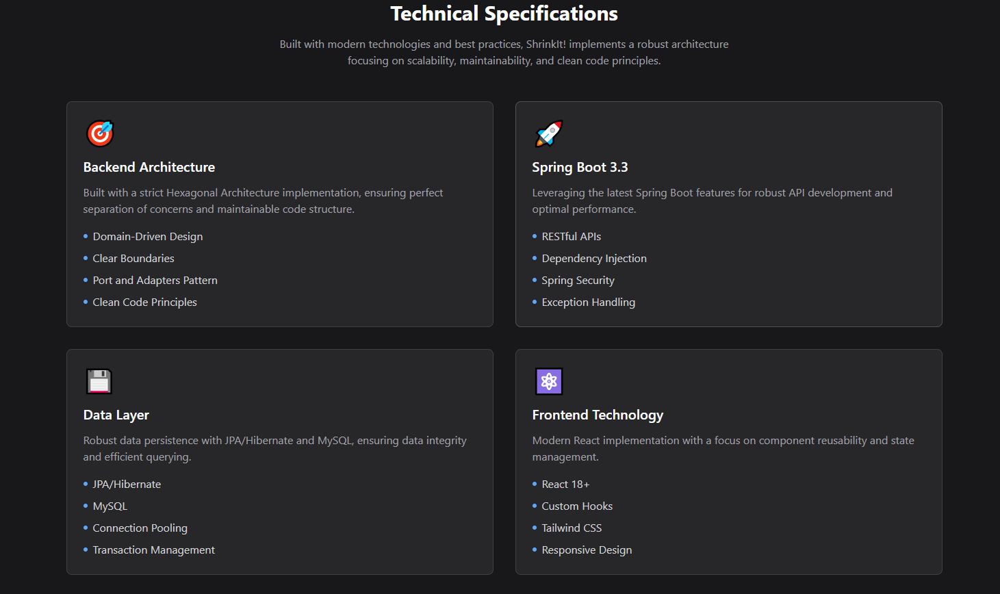

<h1 align=center> 🌐 ShrinkIt! 🔪</h1>

**ShrinkIt!** is a URL shortening project crafted to solidify practical experience with the hexagonal architecture in a strict, real-world Spring Boot application. By diving deep into clean architecture principles, dependency inversion, custom handlers, DTO patterns, and seamless port-adapter interactions, this project encapsulates a well-defined structural approach for scalable software. The frontend component, built with React, complements this architecture by utilizing custom hooks, environment-based configuration for code portability, and TailwindCSS for modern, responsive design.

## 🎯 Motivation

The primary motivation for ShrinkIt! was not to build an advanced URL shortener but to deeply integrate **hexagonal architecture** within Spring Boot, a challenge seldom encountered in typical layered architecture setups. This project serves as a focused exercise in structuring code according to clean architecture standards, including:

- **Hexagonal Architecture**: Implemented to strictly separate the domain, application, and infrastructure layers.
- **Custom DTO and Handler Pattern**: Uses generic, specialized handlers and DTOs to organize business logic and data exchange.
- **Dependency Injection & Inversion of Control**: All service dependencies are injected for maximum flexibility and scalability.
- **Port-Adapter Structure**: Clearly defined ports (interfaces) and adapters across layers allow seamless communication and loose coupling.
- **Database implementation**: Backend server works by default with MySql 8.X, due to Hexagonal Architecture, it can be changed for any relational datase.

Furthermore, **ShrinkIt!** is optimized to run locally (via `localhost:8080`), with all configurations adjustable in the `application.properties` file. This setup reflects a production-grade environment, enabling practical testing and validation.

## Preview

Initial part with a little description and the table where all the magic happens. 🔮


Description of the technologies implemented in the project. 💻



## 🖥️ Frontend Built with React

The frontend of ShrinkIt! is powered by **React** and designed with a modern development approach that demonstrates my full-stack capabilities:

- **Custom Hooks**: Modularized logic for stateful operations within the app, enhancing code reusability and readability.
- **TailwindCSS**: Provides a sleek, responsive design with utility-first styling, delivering a polished user experience.
- **Environment-Based Configurations**: Easily modifiable environment variables enable seamless portability and deployment flexibility.

ShrinkIt! leverages these React features to create a professional, efficient, and adaptable frontend that pairs seamlessly with the backend architecture.

## 🚀 Features

- **Shortened Links with Security**: URLs are shortened using a combination of `BASE62` encoding and `SHA-256` hashing to ensure unique, non-conflicting shortened links.
- **Local Development Optimized**: The project is configured for local development with `localhost:8080` and can be customized via `application.properties`.
- **Clean Architecture for Real-World Projects**: Perfectly suited for practicing clean architecture principles and gaining hands-on experience with hexagonal structures, DTOs, and handler patterns.


## 📦 How to Run the Project

### Backend (Spring Boot) - Maven

1. **Clone the Repository**:

   ```bash
        git clone https://github.com/Andres-Shadow/ShrinkIt.git
   ```

2. **Create the database**:

    ```bash
        mysql -u root -p
        <password>
        create database shrinkit;
    ```

3. **Build and Run the Backend**:

    ```bash
        cd shrinkit/backend/Shrinkit
        mvn clean install
        mvn spring-boot:run
    ```

    The backend server will start by default on http://localhost:8080.

### Frontend (React Project) - NPM

1. **Run the Frontend**:

    ```bash
    cd shrinkit/frontend/shrinkit
    npm install
    npm run dev
    ```

## 🤔 Why This Project Matters

With ShrinkIt!, my goal wasn’t to create the most powerful URL shortener, but rather to deepen my understanding of modern application architecture. This project provided a hands-on way for me to refine and demonstrate my full-stack development skills. Working on ShrinkIt! allowed me to dive into key concepts such as:

- Hexagonal architecture in Spring Boot.
- Clean separation of concerns across multiple layers.
- Creating adaptable, reusable frontend components.

ShrinkIt! stands as a complete, professional showcase of full-stack design and implementation, a vital asset for any developer aiming to excel in modern software engineering. 😎
